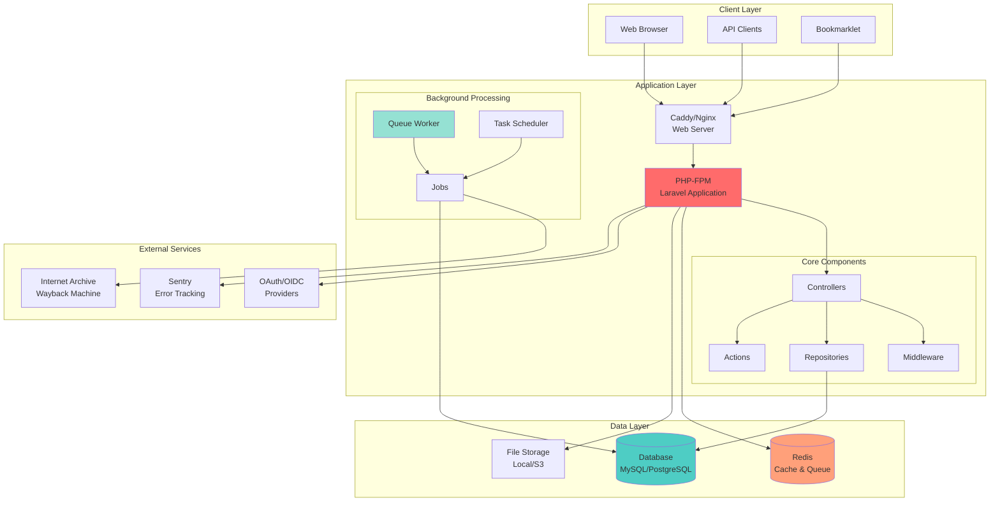
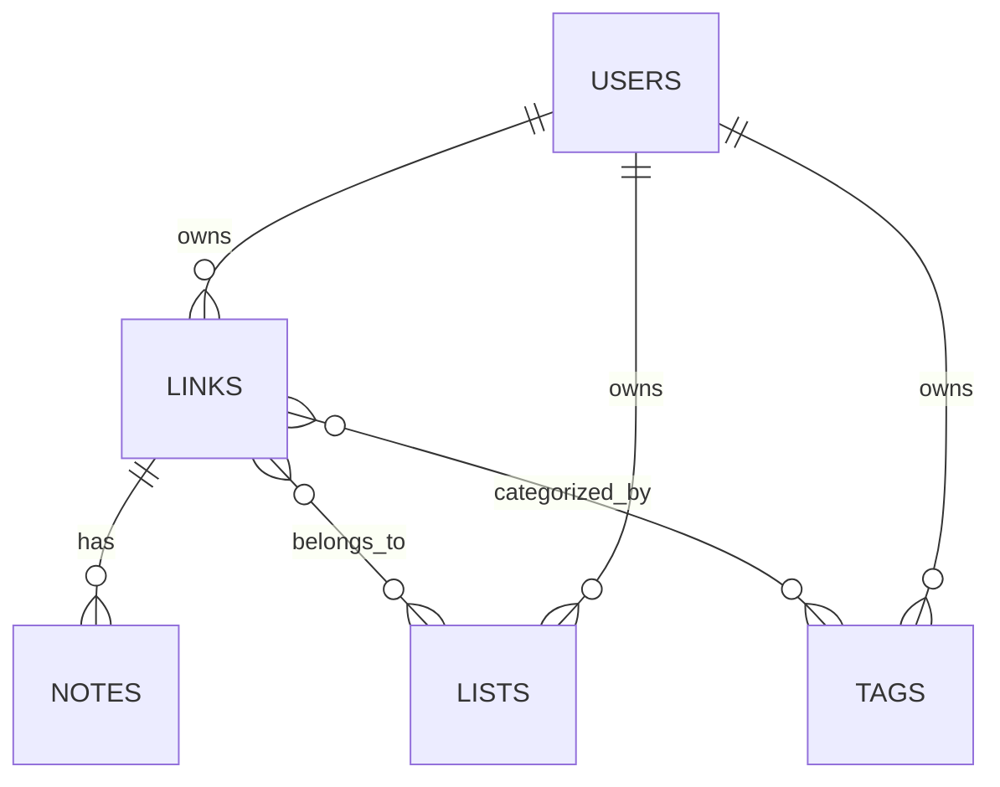
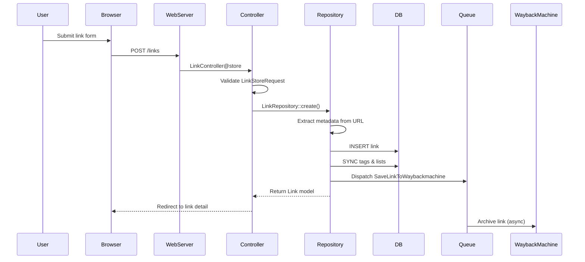
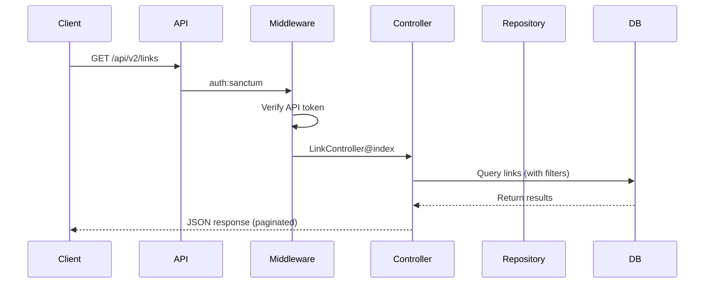
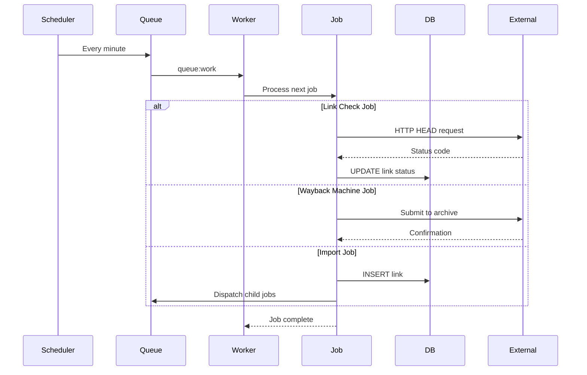

{/* Build timestamp: 1765422544681 - Forces cache invalidation */}

**Last Updated:** 12/11/2025

---

# Architecture

LinkAce is a self-hosted bookmark management application built with **Laravel 10** and **PHP 8.1+**. The system follows a traditional **MVC architecture** with additional layers for repositories, actions, and background jobs. It supports multi-user environments with OAuth/OIDC authentication, automated link monitoring, and backup capabilities.

## System Overview



## Core Architecture Layers

### 1. Web Layer

**Entry Point:** `public/index.php`

The web layer handles all incoming HTTP requests through a web server (Caddy in development, typically Nginx/Apache in production).

- **Web Server**: Serves static assets and proxies dynamic requests to PHP-FPM
- **Routes**: Defined in `routes/web.php` (UI) and `routes/api.php` (REST API)
- **Middleware Stack**:
  - `SetupCheckMiddleware` - Ensures application is configured
  - `Authenticate` - Handles user authentication via Laravel Sanctum
  - `GuestAccess` - Controls public/guest access to content
  - `SettingsMiddleware` - Loads user settings into session
  - `ApiHeaderValidationMiddleware` - Validates API requests

### 2. Application Layer

#### Controllers (`app/Http/Controllers/`)

Controllers are organized by function and access level:

- **`Models/`** - CRUD operations for core entities (Links, Lists, Tags, Notes)
- **`API/`** - RESTful API endpoints (v2) with Sanctum authentication
- **`App/`** - Application features (Dashboard, Search, Import/Export)
- **`Admin/`** - System administration (User Management, Settings, Audit Logs)
- **`Guest/`** - Public-facing pages for shared content
- **`Setup/`** - Initial installation wizard

#### Repositories (`app/Repositories/`)

Repositories encapsulate complex business logic and data operations:

```
LinkRepository     - Link creation, updates, taxonomy management
ListRepository     - List operations
TagRepository      - Tag operations
NoteRepository     - Note CRUD
TrashRepository    - Soft delete management
```

**Key Responsibilities:**
- Data validation and transformation
- Relationship management (many-to-many for tags/lists)
- Automatic metadata extraction (title, description, favicon)
- Audit trail creation for changes
- Triggering background jobs

#### Actions (`app/Actions/`)

Actions handle specific business operations:

- **`ImportHtmlBookmarks`** - Processes bookmark imports from HTML files
- **`Fortify/`** - User authentication flows (registration, password reset)
- **`Settings/`** - Application and user settings management

### 3. Background Processing

#### Queue System

**Default Driver:** Database-backed queue (configurable to Redis, SQS, etc.)

The queue system handles asynchronous tasks:

```php
// Queue configuration: config/queue.php
'default' => env('QUEUE_CONNECTION', 'database')
```

**Queue Worker:** Runs via scheduler every minute, processes up to 30 jobs per cycle

```php
$schedule->command('queue:work', [
    '--queue' => 'default,import',
    '--max-jobs' => '30',
    '--stop-when-empty',
])->withoutOverlapping();
```

#### Jobs (`app/Jobs/`)

- **`SaveLinkToWaybackmachine`** - Submits links to Internet Archive for preservation
- **`ImportLinkJob`** - Processes individual links during bulk import

#### Scheduled Tasks (`app/Console/Kernel.php`)

The Laravel scheduler runs these tasks automatically:

| Task | Schedule | Purpose |
|------|----------|---------|
| `queue:work` | Every minute | Process queued jobs |
| `links:check` | Every 2 hours | Monitor link availability (status checks) |
| `backup:clean` | Daily (01:00) | Remove old backups |
| `backup:run` | Daily (02:00) | Create new backup |

### 4. Data Layer

#### Database

**Supported:** MySQL/MariaDB, PostgreSQL, SQLite

**Core Tables:**

```
users                    - User accounts
links                    - Bookmarked URLs
lists                    - Link collections
tags                     - Categorization tags
notes                    - Link annotations
link_lists               - Many-to-many: links ↔ lists
link_tags                - Many-to-many: links ↔ tags
personal_access_tokens   - API authentication (Sanctum)
audits                   - Audit trail for all changes
activity_log             - User activity tracking
settings                 - Application/user settings
user_invitations         - Pending user invites
jobs                     - Queue jobs
failed_jobs              - Failed queue jobs
```

**Key Relationships:**



#### Caching

**Driver:** File-based (default) or Redis

- User settings cached per request
- Metadata extraction results cached (1 hour TTL)
- Query results cached where applicable

#### File Storage

**Filesystems (`config/filesystems.php`):**

- **`local`** - Application storage (`storage/app/`)
- **`local_backups`** - Backup storage (`storage/app/backups/`)
- **`s3`** - AWS S3 or compatible (optional)

**Stored Data:**
- Backups (database + application files)
- Logs
- Session files
- Cached data

### 5. Authentication & Authorization

#### Authentication

**Primary:** Laravel Fortify + Sanctum

- **Web Authentication**: Session-based with cookie authentication
- **API Authentication**: Token-based via Sanctum personal access tokens
- **OAuth/OIDC**: Supported providers include Authentik, Keycloak, Azure AD, Okta, Auth0, Cognito, FusionAuth, Zitadel

#### Authorization

**Package:** `spatie/laravel-permission`

**Roles:**
- `admin` - Full system access
- `user` - Standard user (default)

**Policies (`app/Policies/`):**
- Permission checks based on ownership and visibility settings
- Three visibility levels: Private, Internal (shared with other users), Public

### 6. External Integrations

#### Internet Archive (Wayback Machine)

- Automatically archives links when created (if enabled)
- Respects privacy settings (can disable for private links)
- Runs asynchronously via queue jobs

#### OAuth/OIDC Providers

Configured via `config/services.php` and environment variables:

```php
'authentik' => [
    'client_id' => env('AUTHENTIK_CLIENT_ID'),
    'client_secret' => env('AUTHENTIK_CLIENT_SECRET'),
    'redirect' => env('AUTHENTIK_REDIRECT_URI'),
    'base_url' => env('AUTHENTIK_BASE_URL'),
],
```

#### Error Tracking

**Sentry Integration** (optional):
- Automatic exception reporting
- Performance monitoring
- Configured via `config/sentry.php`

## Request Flow

### Web Request Flow (Creating a Link)



### API Request Flow



### Background Job Flow



## Critical Components

### Link Monitoring System

**Command:** `app/Console/Commands/CheckLinksCommand.php`

- Runs every 2 hours via scheduler
- Checks HTTP status codes of stored links
- Updates link status: OK (1), Moved (2), Broken (3)
- Respects `check_disabled` flag on individual links
- Handles redirects and timeouts

### Import System

**Flow:**
1. User uploads HTML bookmark file
2. `ImportHtmlBookmarks` action parses file using `shaarli/netscape-bookmark-parser`
3. Creates `ImportLinkJob` for each bookmark
4. Jobs queued to `import` queue for processing
5. Each job creates link with metadata extraction

### Backup System

**Package:** `spatie/laravel-backup`

**Components:**
- Database dump (compressed)
- Application files (excluding vendor/, node_modules/, .git/)
- Supports S3-compatible storage
- Email notifications on success/failure
- Automatic cleanup of old backups

**Configuration:** `config/backup.php`

### Metadata Extraction

**Helper:** `app/Helper/HtmlMeta.php`

When creating a link:
1. Fetch URL content via HTTP client
2. Parse HTML using `masterminds/html5`
3. Extract Open Graph tags, meta tags, title
4. Extract favicon URL
5. Cache results (1 hour)
6. Fall back to URL as title if extraction fails

### Audit System

**Package:** `owen-it/laravel-auditing`

**Tracked Events:**
- All CRUD operations on Links, Lists, Tags, Notes
- Relationship changes (tag/list assignments)
- Visibility changes
- User management actions

**Storage:** `audits` table with JSON old/new values

## Deployment Architecture

### Docker-based Deployment (Recommended)

```yaml
services:
  db:           # MariaDB or PostgreSQL
  redis:        # Cache & queue backend
  php:          # Laravel application
  caddy:        # Web server & reverse proxy
```

**Volumes:**
- Database data
- Application storage
- Backups

### Traditional PHP Deployment

**Requirements:**
- PHP 8.1+ with extensions: PDO, DOM, FTP
- MySQL 8.0+ or PostgreSQL 12+
- Redis (optional, for caching/queues)
- Web server (Nginx/Apache)
- Composer for dependencies
- Node.js for asset compilation

**Key Paths:**
- Document root: `public/`
- Writable: `storage/`, `bootstrap/cache/`
- Environment: `.env` file

## Performance Considerations

### Caching Strategy

- **Query Results**: Eager loading relationships to prevent N+1 queries
- **User Settings**: Loaded once per request via middleware
- **Metadata**: Cached for 1 hour after extraction
- **Redis**: Optional but recommended for production

### Database Optimization

- Indexes on foreign keys and frequently queried columns
- Soft deletes for data retention
- Pagination on all list views (configurable: 12-120 items)

### Queue Processing

- Separate queues for imports (`import`) vs. general tasks (`default`)
- Max 30 jobs per worker cycle to prevent memory issues
- `--stop-when-empty` flag to free resources when idle

### Asset Compilation

**Build Tool:** Laravel Mix (Webpack wrapper)

- JavaScript bundled to `public/assets/dist/js/`
- SCSS compiled to CSS (light + dark themes)
- Bootstrap 5 + Tom Select included
- Production builds are minified and versioned

## Security Features

### Input Validation

- Form Request classes for all user inputs
- CSRF protection on all POST/PUT/DELETE requests
- XSS prevention via Blade template escaping
- SQL injection prevention via Eloquent ORM

### Authentication Security

- Password hashing via bcrypt
- Two-factor authentication support (Fortify)
- API rate limiting (configurable)
- Session security (HTTP-only cookies)

### Data Privacy

- Three-tier visibility system (Private/Internal/Public)
- Soft deletes for data recovery
- Optional Internet Archive backup for private links
- Guest access can be disabled globally

### Audit Trail

- Complete history of all changes
- User activity logging
- Failed login attempts tracked
- Admin actions audited

## Configuration

Key configuration files:

| File | Purpose |
|------|---------|
| `config/app.php` | Application settings, timezone, locale |
| `config/database.php` | Database connections |
| `config/queue.php` | Queue driver configuration |
| `config/cache.php` | Cache driver settings |
| `config/backup.php` | Backup schedule and destinations |
| `config/linkace.php` | App-specific defaults (pagination, formats) |
| `config/fortify.php` | Authentication features |
| `config/services.php` | OAuth provider credentials |

All sensitive values are stored in `.env` and referenced via `env()` helper.