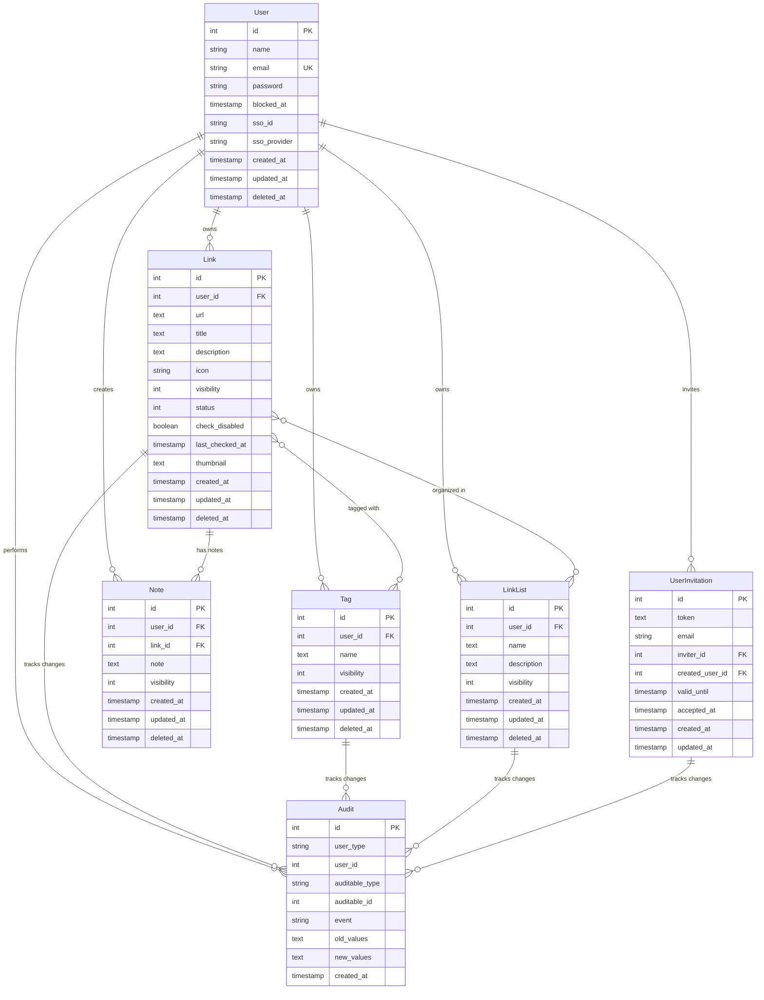

{/* Build timestamp: 1765422107998 - Forces cache invalidation */}

**Last Updated:** 12/11/2025

---

# Data Model

LinkAce is a self-hosted bookmark management application built on Laravel. This document describes the core entities, their relationships, and how data flows through the system.

## Overview

LinkAce's data model centers around **Links** (bookmarks) that can be organized using **Tags** and **Lists**, with additional **Notes** for context. The system supports multi-user functionality with granular visibility controls and comprehensive audit tracking.

## Core Entities

### Link

The central entity representing a bookmarked URL. Links are owned by users and can be organized, monitored, and shared.

**Key Fields:**
- `id` - Primary key
- `user_id` - Foreign key to the owning user
- `url` - The bookmarked URL (text)
- `title` - Display title for the link
- `description` - Optional markdown-enabled description
- `icon` - Icon identifier for visual representation
- `visibility` - Access control level (1=Public, 2=Internal, 3=Private)
- `status` - Link health status (1=OK, 2=Moved, 3=Broken)
- `check_disabled` - Flag to disable automated link checking
- `last_checked_at` - Timestamp of last link health check
- `thumbnail` - Optional preview image
- `created_at`, `updated_at`, `deleted_at` - Standard timestamps with soft delete support

**Relationships:**
- Belongs to one `User`
- Many-to-many with `Tag` (via `link_tags` pivot)
- Many-to-many with `LinkList` (via `link_lists` pivot)
- Has many `Note` records
- Has many `Audit` records (polymorphic)

**Business Logic:**
- Automated link health monitoring tracks broken or moved URLs
- Internet Archive integration for automatic backups
- Duplicate URL detection to prevent redundant bookmarks
- Visibility scopes control access in multi-user environments

### Tag

Flexible categorization mechanism for organizing links. Tags can be shared across users or kept private.

**Key Fields:**
- `id` - Primary key
- `user_id` - Foreign key to the owning user
- `name` - Tag label (text)
- `visibility` - Access control level (1=Public, 2=Internal, 3=Private)
- `created_at`, `updated_at`, `deleted_at` - Standard timestamps with soft delete

**Relationships:**
- Belongs to one `User`
- Many-to-many with `Link` (via `link_tags` pivot)

**Notes:**
- Tags are ordered alphabetically by default (via `OrderNameScope`)
- Support visibility-based filtering for multi-user scenarios

### LinkList

Collections of related links, similar to folders or playlists. Lists provide a way to group links thematically.

**Key Fields:**
- `id` - Primary key
- `user_id` - Foreign key to the owning user
- `name` - List name (text)
- `description` - Optional markdown-enabled description
- `visibility` - Access control level (1=Public, 2=Internal, 3=Private)
- `created_at`, `updated_at`, `deleted_at` - Standard timestamps with soft delete

**Relationships:**
- Belongs to one `User`
- Many-to-many with `Link` (via `link_lists` pivot)

**Notes:**
- Stored in the `lists` table (historical naming)
- Lists are ordered alphabetically by default (via `OrderNameScope`)
- RSS feed support for public and private lists

### Note

Additional context or annotations attached to specific links. Notes are user-specific and can have independent visibility settings.

**Key Fields:**
- `id` - Primary key
- `user_id` - Foreign key to the note author
- `link_id` - Foreign key to the associated link
- `note` - The note content (text, markdown-enabled)
- `visibility` - Access control level (1=Public, 2=Internal, 3=Private)
- `created_at`, `updated_at`, `deleted_at` - Standard timestamps with soft delete

**Relationships:**
- Belongs to one `User`
- Belongs to one `Link`

### User

Represents application users with authentication, authorization, and ownership of content.

**Key Fields:**
- `id` - Primary key
- `name` - Display name
- `email` - Unique email address for authentication
- `password` - Hashed password
- `blocked_at` - Timestamp when user was blocked (null if active)
- `sso_id`, `sso_provider`, `sso_token`, `sso_token_secret`, `sso_refresh_token` - OAuth/OIDC integration fields
- `two_factor_secret`, `two_factor_recovery_codes` - 2FA support
- `created_at`, `updated_at`, `deleted_at` - Standard timestamps with soft delete

**Relationships:**
- Has many `Link` records
- Has many `Tag` records
- Has many `LinkList` records
- Has many `Note` records
- Has many `UserInvitation` records (as inviter)
- Uses Spatie Permission package for roles and permissions

**Notes:**
- System user (ID=0) exists for system-generated content
- Supports both traditional authentication and SSO (OAuth/OIDC)
- Two-factor authentication via Laravel Fortify

### UserInvitation

Manages the user invitation workflow for adding new users to the system.

**Key Fields:**
- `id` - Primary key
- `token` - Unique invitation token (redacted in audits)
- `email` - Email address of invitee
- `inviter_id` - Foreign key to the user who created the invitation
- `created_user_id` - Foreign key to the user created from this invitation (null until accepted)
- `valid_until` - Expiration timestamp
- `accepted_at` - Timestamp when invitation was accepted
- `created_at`, `updated_at` - Standard timestamps

**Relationships:**
- Belongs to `User` as `inviter`
- Belongs to `User` as `createdUser` (when accepted)

## Supporting Entities

### Audit

Tracks all changes to auditable models (Link, LinkList, Tag, User, UserInvitation) for compliance and history.

**Key Fields:**
- `id` - Primary key
- `user_type`, `user_id` - Polymorphic reference to the user who made the change
- `auditable_type`, `auditable_id` - Polymorphic reference to the changed entity
- `event` - Type of change (created, updated, deleted, restored, relatedModels, blocked, unblocked)
- `old_values`, `new_values` - JSON snapshots of changed attributes
- `url`, `ip_address`, `user_agent` - Request context
- `tags` - Optional categorization
- `created_at`, `updated_at` - Timestamps

**Notes:**
- Powered by the OwenIt/Auditing package
- Custom modifiers format visibility, status, and relationship changes
- Migrated from legacy `revisions` table

### Settings

Key-value storage for application and user-specific configuration.

**Key Fields:**
- `id` - Primary key
- `group` - Configuration namespace
- `name` - Setting key
- `locked` - Prevents modification
- `payload` - JSON-encoded setting value
- `created_at`, `updated_at` - Timestamps

**Constraints:**
- Unique constraint on (`group`, `name`)

### Personal Access Tokens

Laravel Sanctum tokens for API authentication.

**Key Fields:**
- Standard Sanctum schema (name, token, abilities, expires_at, etc.)

### Permissions & Roles

Spatie Permission package tables for role-based access control:
- `permissions` - Permission definitions
- `roles` - Role definitions
- `model_has_permissions` - Direct permission assignments
- `model_has_roles` - Role assignments to users
- `role_has_permissions` - Permissions granted to roles

## Entity Relationship Diagram

## Data Flow Patterns

### Link Creation Flow

1. User submits a URL via web interface, API, or bookmarklet
2. System fetches metadata (title, description, icon) from the URL
3. Link record is created with user ownership and visibility settings
4. Optional associations with Tags and Lists are established via pivot tables
5. Audit record is created to track the creation event
6. If enabled, Internet Archive backup job is dispatched to queue
7. Link health monitoring is scheduled for periodic checks

### Visibility & Access Control

LinkAce implements three visibility levels across all major entities:

- **Public (1)**: Visible to all users and potentially accessible via public URLs
- **Internal (2)**: Visible only to authenticated users of the instance
- **Private (3)**: Visible only to the owning user

Visibility is enforced through:
- Query scopes (`publicOnly()`, `internalOnly()`, `privateOnly()`)
- User-specific scopes (`byUser()`)
- Middleware and policy-based authorization

### Background Job Processing

LinkAce uses Laravel's queue system for asynchronous operations:

**Queue Connection**: Database-backed by default (configurable to Redis, SQS, etc.)

**Key Jobs:**
- `SaveLinkToWaybackmachine` - Archives links to Internet Archive
- `ImportLinkJob` - Processes bulk bookmark imports
- Link health checks (scheduled via Laravel's task scheduler)

**Failed Jobs**: Tracked in `failed_jobs` table for retry and debugging

### Audit Trail

Every modification to Links, Lists, Tags, Users, and Invitations is tracked:

1. Model events (created, updated, deleted, restored) trigger audit creation
2. Custom events (relatedModels, blocked, unblocked) handle special cases
3. Audit modifiers format complex attributes (visibility, status, relations)
4. Old and new values are stored as JSON for complete history
5. Request context (URL, IP, user agent) is captured for security

### Soft Deletes

All primary content entities use soft deletes:
- Records are marked with `deleted_at` timestamp instead of being removed
- Relationships use `withTrashed()` to maintain referential integrity
- Audit trail preserves complete history including deleted items
- Users can restore soft-deleted items

## Constraints & Validation

### Database Constraints

- **Unique Constraints**: User email, Settings (group, name)
- **Foreign Keys**: All relationships enforce referential integrity
- **Indexes**: 
  - User email
  - Audit polymorphic relationships
  - Job queue
  - Permission polymorphic relationships

### Application-Level Validation

- URL format validation on Link creation
- Email format validation for Users and Invitations
- Visibility level enumeration (1-3)
- Status enumeration (1-3 for Links)
- Markdown sanitization for user-generated text content

## Performance Considerations

### Indexing Strategy

- Primary keys are auto-indexed
- Foreign keys should be indexed for join performance
- Polymorphic relationships (`auditable_type`, `auditable_id`) are indexed
- User lookups by email are optimized with unique index

### Query Optimization

- Eager loading is used to prevent N+1 queries on relationships
- Global scopes (e.g., `OrderNameScope`) automatically optimize common queries
- Pagination is implemented for large result sets
- Soft delete scopes prevent accidentally querying deleted records

### Caching Opportunities

- User settings are cached per request
- Tag and List counts can be cached
- Public link feeds can be cached with short TTL

## Migration History

LinkAce has evolved through several major schema changes:

- **v1 → v2**: Major refactoring of privacy system from boolean `is_private` to integer `visibility`
- **Audit System**: Migration from custom `revisions` table to OwenIt/Auditing package
- **OAuth Support**: Added SSO fields to users table
- **Link Monitoring**: Added `status`, `check_disabled`, and `last_checked_at` fields
- **Settings Refactor**: Moved from simple key-value to grouped, typed settings with JSON payloads

## Security Considerations

### Sensitive Data

- Passwords are hashed using Laravel's default bcrypt
- API tokens are hashed in the database (Sanctum)
- OAuth tokens are stored encrypted
- Two-factor secrets are encrypted
- Invitation tokens are redacted in audit logs

### Access Control

- All queries are scoped by user and visibility
- Policies enforce authorization at the controller level
- API authentication requires valid Sanctum tokens
- Role-based permissions via Spatie Permission package

### Data Integrity

- Soft deletes preserve referential integrity
- Foreign key constraints prevent orphaned records
- Audit trail provides complete change history
- Transaction support for complex operations

## Future Considerations

Potential schema enhancements for future versions:

- Full-text search indexes for Link titles and descriptions
- Link categorization beyond Tags and Lists (e.g., hierarchical categories)
- Collaborative features (shared ownership, comments)
- Enhanced analytics (view counts, click tracking)
- External integrations (webhooks, third-party sync)